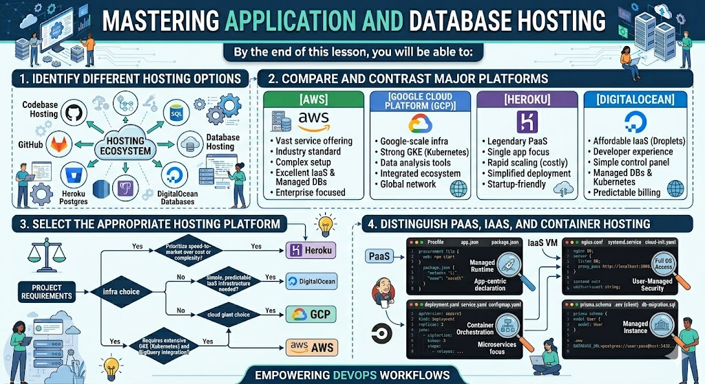

# [4.10] Hosting Options - Manual Hosting

## Lesson Overview

## Dependencies
- [Self Studies](./studies.md)
- [Lesson](./lesson.md)
- [Assignment](./assignment.md)

## Lesson Objectives
* **Identify** different hosting options for both codebase and database
* **Compare** and contrast different hosting platforms
* **Select** the appropriate hosting platform based on project requirements
* **Distinguish** between PaaS, IaaS, and container hosting

## Lesson Plan

| Duration | What | How or Why |
|----------|------|------------|
| 10 min | Warm up | Intro and lesson overview, recap containerization and Docker Hub |
| 20 min | Part 1: Understanding application hosting | What hosting is, types of hosting — PaaS, IaaS, container hosting |
| 30 min | Part 2: Comparing hosting platforms | Railway, Render, Fly.io, Heroku — pros, cons, free tiers, comparison table |
| 10 min | Activity 1 — Platform matching discussion | Learners match platforms to scenarios based on Part 2 comparisons |
| 40 min | Part 3: Deploying to Railway (demo) | Instructor-led demo — pull Docker image, deploy to Railway, generate domain, test endpoint |
| 15 min | Part 4: Hosting databases | Database hosting options, Railway database demo, connecting app to database |
| 25 min | Part 5: Platform selection activity | Small groups work through 4 hosting scenario cards and justify platform choices |
| 15 min | Part 6: Deployment best practices | Environment variables, health checks, logging, resource limits, common issues |
| 10 min | Recap and wrap up | Key takeaways, preview Lesson 4.12 automated deployment, Q&A |
| **Total** | | **175 min — allows ~5 min buffer** |